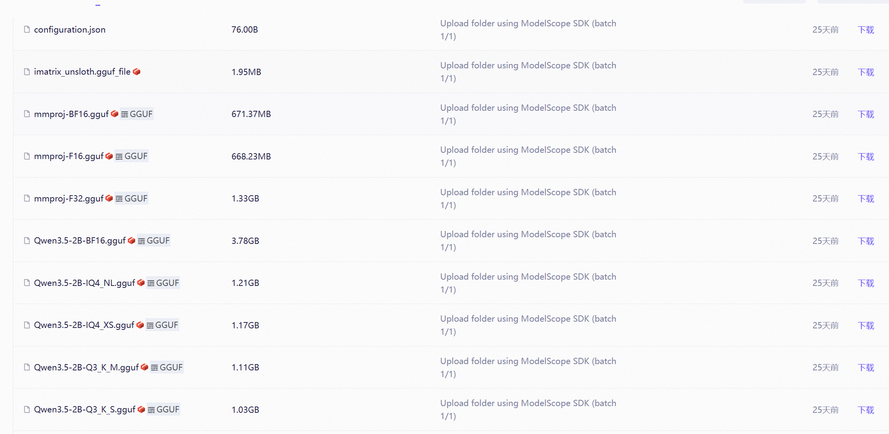
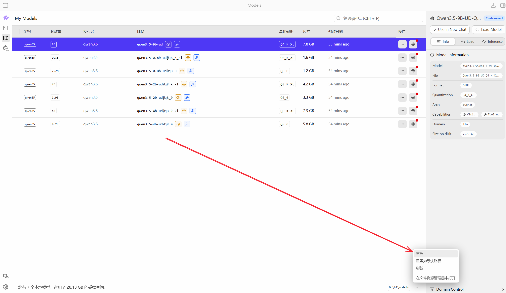

# Qwen3.5

​	强，牛逼，不仅是顶级模型，人家还乐意开源，还是多模态模型，最关键的是他**愿意做小体积，让普通民众这些消费级硬件能玩上本地AI**。

## 本地部署Qwen3.5

### 1.首先下载[LM Studio](https://www.lm-studio.me/)
没什么好说的

### 2.下载模型

到[魔搭社区](https://www.modelscope.cn/)或者[huggingface.co(魔法)](https://huggingface.co/)

推荐[Unsloth AI](https://www.modelscope.cn/organization/unsloth)团队的作品，非常优秀，他团队特供了一种UD的版本

| 特性         | Qwen3.5-4B-Q8_0.gguf               | Qwen3.5-4B-UD-Q8_K_XL.gguf                                   |
| ------------ | ---------------------------------- | ------------------------------------------------------------ |
| 量化类型     | 标准量化                           | 高级混合量化 (UD + K-quants)                                 |
| 精度策略     | 所有权重统一压缩为 8-bit           | 关键层使用更高精度 (如 16-bit)，普通层使用 8-bit             |
| 文件后缀含义 | `Q8_0`：传统的 8-bit 量化格式      | `UD`：通常指 Unsloth Dynamic (动态混合精度) `XL`：Extra Large (超大尺寸/高精度) `K`：K-quant (分组量化策略) |
| 推理速度     | 较快 (计算逻辑统一，硬件友好)      | 稍慢 (因为包含高精度层，计算量略大)                          |
| 智能程度     | 高 (接近原版 FP16)                 | 极高 (理论上比 Q8_0 更接近原版 FP16)                         |
| 适用场景     | 日常对话、代码编写、追求速度的场景 | 复杂逻辑推理、高精度任务、不差那点显存的用户                 |

**⚠️注意：mmproj文件是视觉的必须文件，想要开启视觉的支持，必须将此文件与模型放在同一目录下，推荐F32，视觉差距还是挺大的**

### 3.修改路径

打开LM Studio，改成存放大模型的路径

`D:\AI\models\qwen3.5\Qwen3.5-9B-UD-Q4_K_XL`

LM Studio好像一定要嵌套两个文件夹以上才能读取到大模型....

## 4.模型设置

GPU卸载就是多少模型运行在VRAM(GPU)上，放不完会跑在DRAM(CPU)上

记得留意右上角预计占用的内存大小

